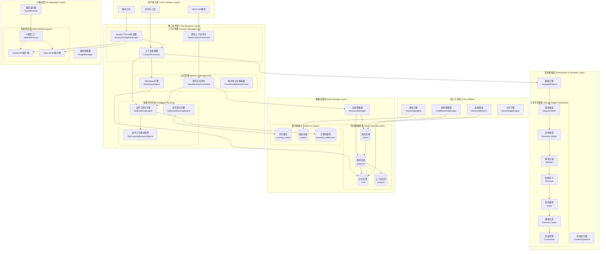

# 技术架构文档

## 🏗️ 整体架构图



## 📁 模块架构

### 核心模块结构

```
src/
├── agent/                  # AI Agent实现
│   ├── claude/            # Claude API集成
│   │   ├── claude_api_client.py    # API客户端
│   │   ├── claude_model_impl.py    # Claude模型实现
│   │   ├── model_runner.py         # 模型运行器
│   │   └── model_usage_manager.py  # 使用量管理
│   └── env_config.py      # 环境配置
├── api/                   # API服务
│   └── api_server.py      # REST API服务器
├── commands/              # 命令行工具
│   ├── base_command.py            # 命令基类
│   ├── team_context_command.py    # 团队上下文命令
│   └── team_memory_command.py     # 团队记忆命令
├── core/                  # 核心模块
│   ├── context_processor.py       # 上下文处理器 ⭐
│   ├── system_prompt_generator.py # System Prompt生成器 ⭐
│   ├── directory_manager.py       # 目录管理器
│   ├── markdown_engine.py         # Markdown存储引擎
│   ├── optimized_scoring_engine.py # 优化评分引擎 ⭐
│   ├── procedural_memory_parser.py # 程序性记忆解析器
│   ├── advanced_search.py         # 高级搜索
│   ├── collaboration_manager.py   # 协作管理器
│   ├── content_optimizer.py       # 内容优化器
│   ├── reporting_engine.py        # 报告引擎
│   ├── seven_stage_engine.py      # 七步引擎
│   └── template_engine.py         # 模板引擎
├── scoring_self_evolution/        # 自学习评分模块 ⭐
│   ├── enhanced_memory_scoring_engine.py  # 自学习评分引擎
│   ├── learning_visualization.py          # 学习可视化
│   └── self_learning_keyword_matrix.json  # 学习矩阵
└── seven_stage_framework/         # 七步开发框架 ⭐
    ├── 00_overview.md     # 框架概述
    ├── 01_requirements.md # 需求锚定
    ├── 02_business_model.md # 业务模型
    ├── 03_solution.md     # 解决方案
    ├── 04_structure.md    # 结构定义
    ├── 05_tasks.md        # 任务编排
    ├── 06_common_tasks.md # 通用任务
    └── 07_constraints.md  # 约束控制
```

## 🔧 核心组件详解

### 1. 上下文处理器 (ContextProcessor)

**职责**: 核心的上下文生成引擎
**位置**: `src/core/context_processor.py`

```python
class ContextProcessor:
    def generate_context(self, config: ContextGenerationConfig, user_message: str = None) -> GeneratedContext
    def _find_relevant_memories_by_message(self, memories: List[MemoryEntry], user_message: str) -> List[MemoryEntry]
    def _calculate_memory_relevance_score(self, memory: MemoryEntry, message_keywords: List[str], full_message: str) -> float
```

**核心特性**:
- 支持三种生成模式: MEMORY_ONLY, FRAMEWORK_ONLY, HYBRID
- 智能记忆匹配算法
- 多维度评分机制
- 集成优化评分引擎

### 2. System Prompt生成器 (SystemPromptGenerator)

**职责**: 智能生成System Prompt
**位置**: `src/core/system_prompt_generator.py`

```python
class SystemPromptGenerator:
    def generate_system_prompt(self, user_message: str, team_name: str, **kwargs) -> Dict[str, Any]
    def enable_learning(self, enabled: bool = True)
    def provide_usage_feedback(self, team_name: str, user_message: str, effectiveness: int) -> Dict[str, Any]
```

**核心特性**:
- 自动保存到output目录
- 支持学习机制
- 用户反馈处理
- 多团队支持

### 3. 智能评分引擎 (Scoring Engines)

#### 自学习评分引擎
**位置**: `src/scoring_self_evolution/enhanced_memory_scoring_engine.py`

```python
class SelfLearningMemoryScoringEngine:
    def score_memory_items(self, requirement: str, memory_items: List[MemoryItem]) -> List[MemoryScore]
    def add_user_feedback(self, memory_id: str, query: str, rating: int, **kwargs)
    def save_matrix(self, file_path: str)
```

#### 优化评分引擎
**位置**: `src/core/optimized_scoring_engine.py`

```python
class OptimizedScoringEngine:
    def batch_calculate_scores(self, user_message: str, memories: List[MemoryEntry], max_workers: int = 4) -> List[Tuple]
    def get_performance_stats(self) -> Dict
```

### 4. 七步开发框架

**位置**: `src/seven_stage_framework/`

框架结构:
1. **需求锚定** - 提取需求本质和核心目标
2. **业务模型** - 构建实体关系和数据流模型  
3. **解决方案** - 设计高层架构和技术方案
4. **结构定义** - 定义技术架构和组件关系
5. **任务编排** - 转化为具体可执行任务
6. **通用任务** - 定义编码规范和通用模式
7. **约束控制** - 明确边界条件和质量标准

## 🗃️ 数据架构

### 团队数据组织结构

```
teams/
├── engineering_team/           # 团队目录
│   ├── memory/                # 团队级记忆
│   │   ├── procedural.md      # 程序性记忆
│   │   ├── declarative.md     # 声明性记忆
│   │   ├── episodic/          # 情景性记忆目录
│   │   └── keyword_matrix.json # 学习矩阵
│   ├── context/               # 团队上下文文件
│   │   ├── requirements.md
│   │   ├── business-model.md
│   │   └── ...
│   └── projects/              # 项目目录
│       ├── workflow-management-system/
│       │   ├── memory/        # 项目特定记忆
│       │   │   ├── procedural.md
│       │   │   ├── declarative.md
│       │   │   └── episodic/
│       │   └── context/       # 项目特定上下文
│       └── auth-system/
│           ├── memory/
│           └── context/
├── design_team/
├── product_team/
└── ...
```

### 输出数据结构

```
output/
├── system_prompts/            # System Prompt输出
│   ├── 20250804_143918_engineering_team_hybrid_system_prompt.txt
│   └── ...
├── ai_responses/              # AI响应记录
├── claude_responses/          # Claude特定响应
├── context_tests/             # 上下文测试结果
└── metadata/                  # 元数据文件
```

## 🔄 数据流架构

### 上下文生成数据流

```
用户消息输入 → 关键词提取 → 记忆匹配 → 评分排序 → 框架整合 → System Prompt生成 → 结果保存
     ↓              ↓           ↓         ↓          ↓              ↓
   解析分析    → 技术词汇过滤 → 智能评分 → 相关性筛选 → 内容组合 → 质量检查 → 学习反馈
```

### 学习数据流

```
用户反馈 → 反馈处理 → 权重调整 → 矩阵更新 → 性能统计 → 学习报告
    ↓         ↓         ↓         ↓         ↓         ↓
  评分分析 → 置信度计算 → 稳定性检查 → 缓存更新 → 可视化 → 持久化存储
```

## ⚡ 性能优化架构

### 1. 缓存机制
- **评分缓存**: 避免重复计算相同查询的评分
- **矩阵缓存**: 缓存关键词矩阵以提高访问速度
- **文件缓存**: 缓存经常访问的记忆文件

### 2. 并行处理
- **批量评分**: 并行计算多个记忆项的评分
- **多线程**: 利用多线程处理IO密集型操作
- **异步处理**: 异步处理AI API调用

### 3. 内存管理
- **惰性加载**: 按需加载记忆内容
- **内存池**: 复用对象减少GC压力
- **数据压缩**: 压缩存储大型数据结构

## 🔐 安全架构

### 1. API安全
- **密钥管理**: 环境变量存储API密钥
- **请求限制**: 防止API滥用的请求限制
- **错误处理**: 安全的错误信息处理

### 2. 数据安全
- **文件权限**: 合适的文件系统权限
- **输入验证**: 严格的用户输入验证
- **数据隔离**: 团队间数据隔离

### 3. 隐私保护
- **敏感信息过滤**: 自动检测和过滤敏感信息
- **日志脱敏**: 日志中的敏感数据脱敏
- **本地存储**: 敏感数据本地存储，不上传云端

## 📈 扩展性架构

### 1. 模块化设计
- **插件架构**: 支持第三方插件扩展
- **接口标准化**: 统一的接口规范
- **依赖注入**: 灵活的依赖管理

### 2. AI模型扩展
- **模型工厂**: 易于添加新的AI模型
- **适配器模式**: 统一不同AI API的接口
- **配置驱动**: 通过配置切换不同模型

### 3. 存储扩展
- **存储抽象**: 抽象的存储接口
- **多后端支持**: 支持文件系统、数据库等多种存储
- **数据迁移**: 便捷的数据迁移工具

这个技术架构体现了现代软件系统的最佳实践，具有高内聚、低耦合、可扩展、高性能的特点。