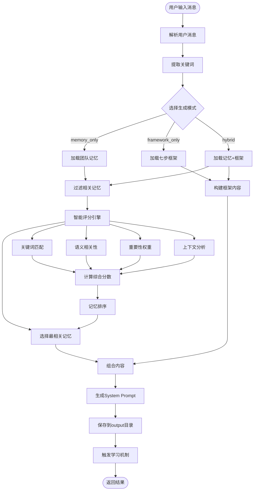
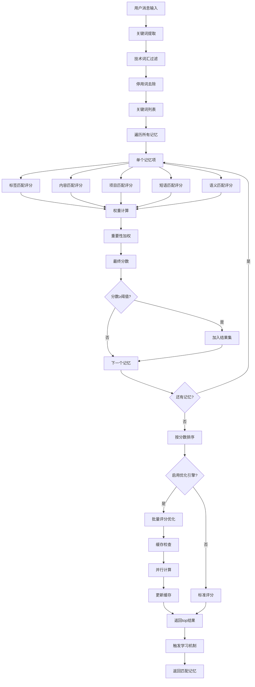

# 核心流程文档

## 🔄 主要业务流程

### 1. System Prompt 生成核心流程



#### 流程详细说明

**阶段1: 输入处理**
- 用户提供消息和团队名称
- 系统解析消息内容，提取技术关键词
- 过滤停用词，识别技术术语

**阶段2: 模式选择**
- **memory_only**: 仅基于团队历史记忆生成
- **framework_only**: 仅基于七步开发框架生成  
- **hybrid**: 结合记忆和框架的混合模式(推荐)

**阶段3: 内容加载**
- 根据团队和项目配置加载相关记忆
- 支持声明性、程序性、情景性三种记忆类型
- 加载对应的框架模板内容

**阶段4: 智能匹配**
- 使用多维度评分算法匹配相关记忆
- 计算语义相关性和重要性权重
- 支持批量并行处理优化性能

**阶段5: 内容生成**
- 将匹配的记忆与框架模板整合
- 生成结构化的System Prompt
- 自动保存到指定输出目录

**阶段6: 学习反馈**
- 记录生成会话信息
- 触发自学习机制更新关键词矩阵
- 支持用户反馈优化

### 2. 智能记忆匹配算法流程



#### 评分算法详解

**多维度评分机制**:
```python
# 综合评分计算
score = (
    tag_matching_score * 3.0 +           # 标签匹配 (权重最高)
    content_matching_score * 2.0 +       # 内容匹配
    project_matching_score * 1.5 +       # 项目匹配
    phrase_matching_score * 4.0 +        # 短语匹配 (精准匹配)
    semantic_relevance_score * 1.5       # 语义相关性
) * importance_weight                     # 重要性加权 (1-5星)
```

**语义相关性计算**:
1. **领域概念密度**: 技术关键词的匹配密度
2. **问题-解决方案匹配**: 识别问题类型与解决方案的对应关系
3. **复合概念匹配**: 识别和匹配复杂的技术概念组合
4. **技术栈相关性**: 基于技术栈的相关性评分

### 3. 自学习评分引擎工作流程

```mermaid
flowchart TD
    Start[系统启动] --> LoadMatrix[加载关键词矩阵]
    LoadMatrix --> MatrixExists{矩阵文件存在?}
    
    MatrixExists -->|是| LoadExisting[加载已有矩阵]
    MatrixExists -->|否| InitMatrix[初始化默认矩阵]
    
    LoadExisting --> Ready[引擎就绪]
    InitMatrix --> Ready
    
    Ready --> UserQuery[接收用户查询]
    UserQuery --> AnalyzeQuery[分析查询内容]
    
    AnalyzeQuery --> KeywordDiscover[关键词发现]
    KeywordDiscover --> TechPattern[技术模式识别]
    TechPattern --> ConfidenceCalc[置信度计算]
    
    ConfidenceCalc --> HighConfidence{置信度≥阈值?}
    HighConfidence -->|是| AddKeyword[自动添加关键词]
    HighConfidence -->|否| SkipAdd[跳过添加]
    
    AddKeyword --> UpdateMatrix[更新矩阵权重]
    SkipAdd --> UpdateMatrix
    
    UpdateMatrix --> ScoreMemories[对记忆项评分]
    ScoreMemories --> UsageStats[记录使用统计]
    
    UsageStats --> LearningCheck[检查学习条件]
    LearningCheck --> StabilityCheck[稳定性检查]
    
    StabilityCheck --> Stable{关键词已稳定?}
    Stable -->|是| MinimalAdjust[最小调整]
    Stable -->|否| ActiveLearning[积极学习]
    
    MinimalAdjust --> WeightUpdate[权重更新]
    ActiveLearning --> WeightUpdate
    
    WeightUpdate --> UserFeedback{收到用户反馈?}
    UserFeedback -->|是| ProcessFeedback[处理反馈]
    UserFeedback -->|否| SaveMatrix[保存矩阵]
    
    ProcessFeedback --> FeedbackScore[反馈评分]
    FeedbackScore --> AdjustWeights[调整权重]
    AdjustWeights --> SaveMatrix
    
    SaveMatrix --> GenerateReport[生成学习报告]
    GenerateReport --> BackToReady[回到就绪状态]
    BackToReady --> UserQuery
```



#### 学习机制详解

**关键词发现算法**:
- **技术模式识别**: CamelCase、连字符、技术后缀
- **置信度评估**: 基于多个因子的综合评分
- **自动添加**: 高置信度关键词自动加入矩阵

**权重调整策略**:
```python
# 自适应权重计算
adjusted_weight = base_weight × stability_factor × performance_factor

# 稳定性因子 (学习期 vs 稳定期)
stability_factor = 1.0 + (learning_rate × usage_ratio)  # 学习期
stability_factor = 1.0 + (learning_rate × 0.1)         # 稳定期

# 性能因子 (基于贡献度)
performance_factor = 1.1   # 高性能 (贡献度 > 0.8)
performance_factor = 0.9   # 低性能 (贡献度 < 0.3)
performance_factor = 1.0   # 一般性能
```

### 4. 七步框架应用流程

```mermaid
flowchart TD
    UserRequest[用户需求] --> S1[🎯 步骤1: 需求锚定]
    S1 --> Extract[提取核心需求本质]
    Extract --> Goals[明确根本目标]
    
    Goals --> S2[🏗️ 步骤2: 业务模型]
    S2 --> Entities[构建业务实体]
    Entities --> Relations[定义实体关系]
    Relations --> DataFlow[设计数据流]
    
    DataFlow --> S3[💡 步骤3: 解决方案]
    S3 --> Architecture[高层架构设计]
    Architecture --> TechStack[技术栈选择]
    TechStack --> Strategy[实现策略]
    
    Strategy --> S4[🔧 步骤4: 结构定义]
    S4 --> Components[定义系统组件]
    Components --> Dependencies[组件依赖关系]
    Dependencies --> Interfaces[接口设计]
    
    Interfaces --> S5[📋 步骤5: 任务编排]
    S5 --> Breakdown[任务分解]
    Breakdown --> Sequence[执行序列]
    Sequence --> Resources[资源分配]
    
    Resources --> S6[🔄 步骤6: 通用任务]
    S6 --> Standards[编码标准]
    Standards --> Patterns[通用模式]
    Patterns --> Templates[模板定义]
    
    Templates --> S7[⚖️ 步骤7: 约束控制]
    S7 --> Boundaries[边界条件]
    Boundaries --> Quality[质量标准]
    Quality --> Validation[验证规则]
    
    Validation --> Integration[框架整合]
    Integration --> Memory[记忆融合]
    Memory --> Prompt[生成System Prompt]
    
    Prompt --> Review[质量检查]
    Review --> Valid{符合标准?}
    Valid -->|是| Output[输出结果]
    Valid -->|否| Refine[优化调整]
    
    Refine --> S3
    Output --> End[完成]
```



#### 七步框架详解

**步骤1: 需求锚定 (Requirements)**
- 提取需求的核心本质和根本目标
- 过滤表面需求，挖掘深层需求
- 确保需求的明确性和完整性

**步骤2: 业务模型 (Business Model)**
- 构建清晰的业务实体关系模型
- 定义数据流和业务流程
- 为后续设计提供概念基础

**步骤3: 解决方案 (Solution)**
- 提供高层次的解决策略和架构方案
- 选择合适的技术栈和实现方向
- 指导具体实现的技术决策

**步骤4: 结构定义 (Structure)**
- 定义系统的技术架构和组件关系
- 明确模块边界和接口设计
- 确保架构的可扩展性和可维护性

**步骤5: 任务编排 (Tasks)**
- 将抽象方案转化为具体可执行的实现任务
- 定义任务的执行顺序和依赖关系
- 分配合适的资源和时间安排

**步骤6: 通用任务 (Common Tasks)**
- 定义统一的编码规范和通用实现模式
- 建立可复用的组件和模板
- 确保代码质量和一致性

**步骤7: 约束控制 (Constraints)**
- 定义明确的边界条件和质量标准
- 建立验证规则和测试策略
- 确保最终交付的质量和可靠性

## 🔧 关键算法实现

### 1. 关键词提取算法

```python
def _extract_keywords_from_message(self, message: str) -> List[str]:
    """从用户消息中提取关键词"""
    
    # 停用词过滤
    stop_words = {
        'the', 'a', 'an', 'and', 'or', 'but', 'in', 'on', 'at', 'to', 'for',
        '我', '你', '他', '她', '的', '了', '在', '是', '有', '这', '那'
    }
    
    keywords = []
    
    # 英文词汇处理
    english_words = re.findall(r'[a-zA-Z]+', message)
    for word in english_words:
        if len(word) >= 3 and word.lower() not in stop_words:
            keywords.append(word.lower())
    
    # 技术术语识别
    tech_patterns = [
        r'工作流', r'workflow', r'API', r'api', r'接口', r'数据库', r'database',
        r'认证', r'authentication', r'权限', r'authorization', r'管理', r'service'
    ]
    
    for pattern in tech_patterns:
        matches = re.findall(pattern, message, re.IGNORECASE)
        keywords.extend([match.lower() for match in matches])
    
    return list(set(keywords))  # 去重
```

### 2. 语义相关性算法

```python
def _calculate_semantic_relevance(self, memory: MemoryEntry, keywords: List[str], message: str) -> float:
    """计算语义相关性得分"""
    semantic_score = 0.0
    
    # 1. 领域概念密度评分 (0-10分)
    domain_keywords = ['api', 'workflow', 'solution', 'rule', 'validation']
    user_concepts = [kw for kw in keywords if kw in domain_keywords]
    memory_text = memory.content.lower() + ' ' + ' '.join(memory.tags).lower()
    
    if user_concepts:
        matches = sum(1 for concept in user_concepts if concept in memory_text)
        domain_density = (matches / len(user_concepts)) * 10
        semantic_score += domain_density
    
    # 2. 问题-解决方案匹配度 (0-15分)
    problem_solution_pairs = [
        (['enhance', 'improve', 'add'], ['design', 'architecture', 'implementation']),
        (['validate', 'check', 'ensure'], ['validation', 'verification', 'logic']),
        (['create', 'build', 'generate'], ['creation', 'construction', 'workflow'])
    ]
    
    for problem_words, solution_words in problem_solution_pairs:
        has_problem = any(word in keywords for word in problem_words)
        has_solution = any(word in memory_text for word in solution_words)
        if has_problem and has_solution:
            semantic_score += 3.0
    
    return semantic_score
```

### 3. 批量优化评分算法

```python
def batch_calculate_scores(self, user_message: str, memories: List[MemoryEntry], max_workers: int = 4) -> List[Tuple]:
    """批量并行计算评分"""
    import concurrent.futures
    
    def calculate_single_score(memory):
        try:
            # 检查缓存
            cache_key = f"{hash(user_message)}_{memory.id}"
            if cache_key in self.score_cache:
                return memory.id, self.score_cache[cache_key], {'cached': True}
            
            # 计算新评分
            score, details = self.calculate_memory_score(user_message, memory)
            
            # 更新缓存
            self.score_cache[cache_key] = score
            return memory.id, score, details
            
        except Exception as e:
            return memory.id, 0.0, {'error': str(e)}
    
    # 并行处理
    with concurrent.futures.ThreadPoolExecutor(max_workers=max_workers) as executor:
        results = list(executor.map(calculate_single_score, memories))
    
    return results
```

## 📊 性能优化策略

### 1. 缓存优化
- **评分缓存**: 缓存用户消息和记忆的评分结果
- **文件缓存**: 缓存经常访问的记忆文件内容
- **矩阵缓存**: 缓存关键词矩阵以避免重复加载

### 2. 并行处理
- **批量评分**: 并行计算多个记忆项的相关性评分
- **多线程处理**: 利用多线程处理IO密集型操作
- **异步API调用**: 异步处理AI模型API调用

### 3. 算法优化
- **早期过滤**: 在详细评分前进行初步过滤
- **增量学习**: 仅更新变化的部分而非重新计算全部
- **内存管理**: 及时释放不再使用的大对象

### 4. 数据结构优化
- **索引建立**: 为经常查询的字段建立索引
- **数据压缩**: 压缩存储大型数据结构
- **惰性加载**: 按需加载数据而非一次性加载全部

这些核心流程和算法确保了系统的高效性、准确性和可扩展性，为用户提供优质的智能上下文生成服务。