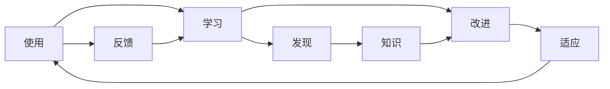
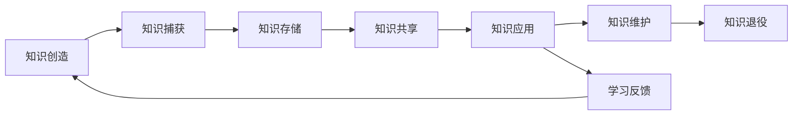

# 设计哲学与核心理念

## 🌟 核心哲学思想

### 1. 智能上下文管理哲学 (Intelligent Context Management)

> **"将软件开发团队的知识和经验转化为智能的、可复用的开发上下文"**

#### 哲学基础
软件开发不应该每次都从零开始。每个团队、每个项目都积累了大量的知识、经验和最佳实践，这些宝贵的智慧资产应该被系统化地管理和复用。

#### 核心观点
- **知识即资产**: 团队的开发经验是可管理、可优化、可传承的数字资产
- **上下文即智慧**: 好的上下文包含了团队的集体智慧和历史经验
- **复用胜过重建**: 基于已有经验的开发比从零开始更高效、更可靠

#### 实现体现
```python
# 将团队经验转化为智能上下文
context = processor.generate_context(
    config=create_hybrid_config(team_name="engineering_team", project_name="workflow-system"),
    user_message="如何实现用户认证功能？"
)
# 结果包含了团队在认证方面的所有历史经验和最佳实践
```

### 2. 记忆驱动开发 (Memory-Driven Development)

> **"让团队的每一次实践都成为未来开发的智慧源泉"**

#### 认知科学基础
借鉴认知科学中的记忆分类理论，将软件开发知识按照人类认知模式进行组织：

- **声明性记忆 (Declarative Memory)**: 存储"是什么"的知识
  - 概念定义、技术原理、架构设计思想
  - 例: "微服务架构的核心思想是服务自治和松耦合"

- **程序性记忆 (Procedural Memory)**: 存储"怎么做"的知识  
  - 操作流程、开发方法、最佳实践
  - 例: "API设计的标准流程: 需求分析 → 接口设计 → 实现 → 测试"

- **情景性记忆 (Episodic Memory)**: 存储"何时何地发生了什么"的知识
  - 具体项目经验、问题解决案例、历史决策
  - 例: "在2024年Q3的用户系统项目中，我们采用JWT+Redis的方案解决了分布式会话问题"

#### 记忆生命周期
```
产生 → 编码 → 存储 → 检索 → 应用 → 更新 → 进化
  ↓      ↓      ↓      ↓      ↓      ↓      ↓
实践经验 → 结构化 → 分类保存 → 智能匹配 → 指导开发 → 反馈优化 → 知识进化
```

### 3. 结构化框架方法论 (Structured Framework Methodology)

> **"将软件开发的复杂性通过结构化的七个阶段进行系统化管理"**

#### 七步框架的认知基础
这不是简单的开发模板，而是基于**认知负荷理论**的系统化思维框架：

1. **🎯 需求锚定** - 认知起点：理解问题本质
2. **🏗️ 业务模型** - 概念建构：建立业务模型  
3. **💡 解决方案** - 策略制定：确定解决路径
4. **🔧 结构定义** - 架构设计：构建系统骨架
5. **📋 任务编排** - 执行计划：分解具体行动
6. **🔄 通用任务** - 标准化：建立通用模式
7. **⚖️ 约束控制** - 质量保证：确保交付标准

#### 认知负荷管理
```
复杂问题 → 结构化分解 → 阶段性处理 → 渐进式构建 → 完整解决方案
     ↓           ↓           ↓           ↓           ↓
   认知超载    → 负荷分散    → 专注处理   → 逐步整合   → 认知清晰
```

### 4. 自学习和进化哲学 (Self-Learning and Evolution)

> **"系统应该从每次使用中学习，持续优化自己的智能水平"**

#### 进化计算思想
系统不是静态的工具，而是**活的、进化的智能体**：

- **变异**: 从新的使用场景中发现新的关键词和模式
- **选择**: 基于使用效果筛选有效的匹配策略
- **遗传**: 将有效的经验固化为系统的"基因"
- **适应**: 根据环境变化调整自己的行为模式

#### 学习闭环


#### 学习机制体现
```python
# 自动关键词发现
discovered_keywords = engine.discover_keywords_from_usage(user_queries)

# 权重自适应调整  
engine.adjust_weights_based_on_performance(usage_feedback)

# 用户反馈学习
engine.learn_from_user_feedback(memory_id, effectiveness_rating)
```

## 🎯 设计原则

### 1. 层次化组织原则 (Hierarchical Organization)

#### 认知层次理论
基于**认知层次理论**，知识应该按照抽象层次进行组织：

```
全局层面 (Global) → 团队层面 (Team) → 项目层面 (Project) → 具体实现 (Implementation)
     ↓                ↓                ↓                    ↓
   通用标准        → 团队规范        → 项目特定        → 代码细节
```

#### 继承与隔离
- **继承**: 项目继承团队的通用知识和标准
- **隔离**: 项目间的特定知识相互隔离，避免干扰
- **覆盖**: 项目级别的知识可以覆盖团队级别的通用知识

```python
# 体现层次化组织的配置
config = ContextGenerationConfig(
    team_name="engineering_team",           # 团队层面
    project_name="workflow-system",         # 项目层面  
    include_team_memories=True,             # 继承团队知识
    project_scope="workflow-management"     # 项目隔离
)
```

### 2. 智能匹配原则 (Intelligent Matching)

#### 多维度相关性理论
相关性不是单一维度的概念，而是多个维度的综合：

```python
# 多维度匹配策略
relevance_score = (
    lexical_similarity * 0.3 +      # 词汇相似度
    semantic_similarity * 0.4 +     # 语义相似度  
    structural_similarity * 0.2 +   # 结构相似度
    contextual_similarity * 0.1     # 上下文相似度
) * importance_weight * recency_weight
```

#### 智能匹配的层次
1. **字面匹配**: 关键词直接匹配
2. **语义匹配**: 理解词汇的含义和关系
3. **结构匹配**: 识别问题和解决方案的结构模式
4. **上下文匹配**: 考虑使用场景和环境因素

### 3. 多模态融合原则 (Multi-Modal Integration)

#### 互补性理论
不同的信息模态具有互补性，融合使用能够产生**1+1>2**的效果：

- **记忆模式**: 提供历史经验和实践智慧
- **框架模式**: 提供结构化的思维引导
- **混合模式**: 在框架的指导下融入相关经验

#### 动态权重调整
```python
def calculate_mode_weights(user_message, team_context):
    if is_exploratory_question(user_message):
        return {"framework": 0.7, "memory": 0.3}  # 探索性问题更依赖框架
    elif is_specific_implementation(user_message):  
        return {"framework": 0.3, "memory": 0.7}  # 具体实现更依赖经验
    else:
        return {"framework": 0.5, "memory": 0.5}  # 平衡模式
```

### 4. 可扩展架构原则 (Extensible Architecture)

#### 开放封闭原则 (Open-Closed Principle)
系统对扩展开放，对修改封闭：

```python
# 易于扩展的AI模型支持
class AIModelFactory:
    def create_model(self, model_type: str) -> AIModel:
        if model_type == "claude":
            return ClaudeModelImpl()
        elif model_type == "openai": 
            return OpenAIModelImpl()
        elif model_type == "gemini":  # 新增模型无需修改现有代码
            return GeminiModelImpl()
        else:
            raise UnsupportedModelError(model_type)
```

#### 插件化架构
- **核心稳定**: 核心功能保持稳定，不轻易变更
- **插件扩展**: 通过插件机制扩展新功能
- **接口标准**: 定义标准接口，确保兼容性

### 5. 性能优化原则 (Performance Optimization)

#### 性能优化的层次
1. **算法层面**: 选择高效的算法和数据结构
2. **系统层面**: 利用缓存、并行处理等系统优化技术
3. **架构层面**: 通过合理的架构设计避免性能瓶颈

#### 优化策略
```python
# 批量处理优化
def batch_process_memories(memories, user_message, batch_size=10):
    """批量处理记忆，减少系统调用开销"""
    results = []
    for i in range(0, len(memories), batch_size):
        batch = memories[i:i+batch_size]
        batch_results = parallel_score_memories(batch, user_message)
        results.extend(batch_results)
    return results

# 缓存机制
@lru_cache(maxsize=1000)
def get_memory_score(memory_hash, query_hash):
    """缓存计算结果，避免重复计算"""
    return calculate_memory_score(memory_hash, query_hash)
```

### 6. 用户体验原则 (User Experience First)

#### 以用户为中心的设计
- **简洁性**: 复杂的功能通过简洁的接口提供
- **一致性**: 统一的命令格式和响应模式
- **反馈性**: 及时、清晰的操作反馈
- **容错性**: 优雅的错误处理和恢复机制

#### 体验设计实践
```python
# 简洁的API设计
def generate_system_prompt(user_message: str, team_name: str) -> str:
    """一个函数调用完成复杂的上下文生成"""
    return generator.generate_system_prompt(user_message, team_name)

# 详细的进度反馈
print(f"🤖 开始生成System Prompt")
print(f"🔄 正在加载{team_name}团队记忆...")
print(f"🧠 找到{memory_count}个相关记忆")
print(f"✅ System Prompt生成成功!")
```

## 💡 创新思想

### 1. 认知科学驱动的设计

#### 人机协作的认知模型
系统不是替代人类思考，而是**增强人类认知能力**：

- **记忆增强**: 系统作为团队的"外部记忆"，存储和检索大量信息
- **思维引导**: 通过结构化框架引导系统性思考
- **决策支持**: 基于历史数据和最佳实践提供决策建议
- **学习促进**: 通过反馈机制促进个人和团队学习

#### 认知负荷优化
```
认知负荷 = 内在负荷 + 外在负荷 + 相关负荷
    ↓
系统优化 = 减少外在负荷 + 优化相关负荷 + 适当分解内在负荷
```

### 2. 自适应系统架构

#### 系统即生物体
将系统视为**数字生物体**，具有：
- **新陈代谢**: 不断更新和优化内部知识结构
- **免疫系统**: 识别和过滤低质量信息
- **神经网络**: 关键词矩阵作为系统的"神经连接"
- **进化机制**: 通过使用反馈进行自我进化

#### 适应性体现
```python
# 系统根据使用情况自动调整
if usage_frequency > high_threshold:
    system.increase_cache_size()
    system.enable_predictive_loading()
elif usage_frequency < low_threshold:
    system.reduce_memory_footprint()
    system.enable_deep_sleep_mode()
```

### 3. 上下文工程学 (Context Engineering)

#### 上下文即代码
将**上下文生成视为一门工程学科**：
- **需求分析**: 分析用户的上下文需求
- **设计模式**: 建立上下文设计的最佳实践
- **质量保证**: 确保生成上下文的质量和有效性
- **版本管理**: 管理上下文模板的版本和演进
- **测试验证**: 验证上下文的有效性和准确性

#### 上下文质量指标
```python
context_quality = {
    "relevance": 0.95,      # 相关性: 内容与需求的匹配度
    "completeness": 0.88,   # 完整性: 信息的完整程度
    "consistency": 0.92,    # 一致性: 内容的逻辑一致性
    "actionability": 0.90,  # 可操作性: 内容的可执行程度
    "freshness": 0.85       # 新鲜度: 信息的时效性
}
```

### 4. 团队知识资产管理

#### 知识资本理论
将团队知识视为**可量化、可管理的资本**：

- **知识资产评估**: 评估不同知识的价值和重要性
- **知识投资回报**: 计算知识管理的投资回报率
- **知识资产配置**: 优化知识资源的配置和利用
- **知识风险管理**: 管理知识流失和过时的风险

#### 知识生命周期管理


## 🎨 实现哲学

### 1. 简洁胜过复杂 (Simplicity over Complexity)

#### 奥卡姆剃刀原则
**"如无必要，勿增实体"** - 优先选择简洁的解决方案：

```python
# 简洁的接口设计
def generate_prompt(message: str, team: str) -> str:
    """一行代码完成复杂功能"""
    return SystemPromptGenerator().generate(message, team)

# 而不是复杂的多步骤调用
# step1 = initialize_processor()
# step2 = load_team_data(team)  
# step3 = extract_keywords(message)
# step4 = match_memories(keywords)
# step5 = generate_context(memories)
```

#### 简洁性的层次
- **接口简洁**: 提供简单易用的API
- **实现简洁**: 内部实现逻辑清晰简单
- **配置简洁**: 最少的配置达到最大的效果
- **使用简洁**: 用户使用步骤最少

### 2. 配置胜过编码 (Configuration over Code)

#### 声明式编程思想
通过**配置声明意图**，而非编码实现细节：

```python
# 配置驱动的行为控制
config = {
    "mode": "hybrid",
    "memory_types": ["procedural", "declarative"],
    "max_memories": 20,
    "importance_threshold": 3,
    "enable_learning": True,
    "scoring_algorithm": "enhanced"
}

# 而不是硬编码的逻辑分支
# if use_memories and use_framework:
#     if include_procedural and include_declarative:
#         if max_count == 20 and min_importance == 3:
#             ...
```

#### 配置的智能化
- **默认配置**: 提供合理的默认值
- **自动推荐**: 基于使用场景推荐配置
- **配置验证**: 验证配置的合理性和一致性
- **配置进化**: 配置参数随使用效果自动优化

### 3. 组合胜过继承 (Composition over Inheritance)

#### 组合模式的优势
通过**组合不同组件**实现功能，而非复杂的继承层次：

```python
class ContextProcessor:
    def __init__(self):
        # 组合不同的功能组件
        self.markdown_engine = MarkdownEngine()
        self.scoring_engine = OptimizedScoringEngine()
        self.directory_manager = DirectoryManager()
        self.template_engine = TemplateEngine()
    
    def generate_context(self, config):
        # 组合使用各个组件的功能
        memories = self.markdown_engine.load_memories(...)
        scores = self.scoring_engine.calculate_scores(...)
        templates = self.template_engine.load_templates(...)
        return self._combine_components(memories, scores, templates)
```

#### 组合的灵活性
- **动态组合**: 根据需要动态选择和组合组件
- **可替换性**: 单个组件可以独立替换而不影响整体
- **可测试性**: 每个组件可以独立测试
- **可扩展性**: 通过添加新组件扩展功能

### 4. 可观测性优先 (Observability First)

#### 系统透明性
系统的运行状态和决策过程应该是**透明和可观测的**：

```python
# 详细的运行日志
logger.info("🤖 开始生成System Prompt")
logger.info(f"📋 配置参数: 团队={team_name}, 模式={mode}")
logger.info(f"🔍 提取关键词: {keywords}")
logger.info(f"🧠 匹配记忆: {len(matched_memories)}个")
logger.info(f"📊 评分结果: 平均分={avg_score:.2f}")
logger.info(f"✅ 生成完成: 长度={len(result)}字符")

# 性能指标监控
metrics = {
    "processing_time": processing_time,
    "memory_count": len(memories),
    "cache_hit_rate": cache_stats.hit_rate,
    "quality_score": context_quality_score
}
```

#### 可观测性的维度
- **日志记录**: 详细的操作日志和错误信息
- **性能监控**: 实时的性能指标和统计数据
- **状态展示**: 系统内部状态的可视化展示
- **决策解释**: 系统决策过程的可解释性

## 🌟 价值主张体系

### 1. 对团队的价值

#### 知识资产化
- **经验沉淀**: 将分散的个人经验转化为团队资产
- **知识传承**: 确保关键知识不因人员变动而丢失
- **最佳实践**: 建立和推广团队最佳实践
- **学习促进**: 通过知识共享促进团队整体学习

#### 协作效率化
- **统一标准**: 建立团队统一的开发标准和规范
- **减少重复**: 避免重复性的技术调研和方案设计
- **快速上手**: 新成员快速了解团队技术栈和实践
- **质量保证**: 基于历史最佳实践确保方案质量

### 2. 对项目的价值  

#### 质量提升
- **一致性**: 确保项目间技术方案的一致性和连贯性
- **可维护性**: 基于标准化框架产生可维护的代码
- **可扩展性**: 遵循良好架构原则的可扩展系统
- **文档完整**: 自动生成详细完整的技术文档

#### 效率改进
- **快速启动**: 基于模板和经验快速启动新项目
- **减少错误**: 避免重复历史上已经犯过的错误
- **决策支持**: 基于历史数据的技术决策支持
- **风险降低**: 基于经验预测和规避潜在风险

### 3. 对开发者的价值

#### 能力增强
- **智能助手**: AI成为理解上下文的开发伙伴
- **学习平台**: 从团队最佳实践中持续学习成长
- **创新启发**: 从历史经验中发现新的解决思路
- **技能提升**: 通过结构化框架提升技术思维能力

#### 工作效率
- **减少重复**: 避免重复性的基础工作和调研
- **快速决策**: 基于历史经验和数据快速做出技术决策
- **质量保证**: 自动应用最佳实践确保代码质量
- **专注创新**: 将更多精力投入到创新性工作中

## 🚀 未来展望

### 哲学层面的演进

#### 从工具到伙伴
系统将从**被动的工具**演进为**主动的智能伙伴**：
- **预测性建议**: 主动预测开发者的需求并提供建议
- **创新启发**: 基于知识组合启发创新性解决方案
- **学习促进**: 引导开发者学习新的技术和方法
- **质量守护**: 主动发现和预防潜在的质量问题

#### 从个体到生态
系统将从**单一团队工具**演进为**知识生态平台**：
- **跨团队协作**: 促进不同团队间的知识共享和协作
- **行业知识**: 整合行业最佳实践和前沿技术
- **社区贡献**: 为开源社区贡献知识和经验
- **标准制定**: 参与技术标准和规范的制定

这个设计哲学体系代表了对**软件开发本质的深度思考**，它不仅仅是一个工具，更是一种新的开发范式和思维方式的体现。通过将认知科学、系统科学和软件工程相结合，为未来的智能化开发工具提供了理论基础和实践指导。