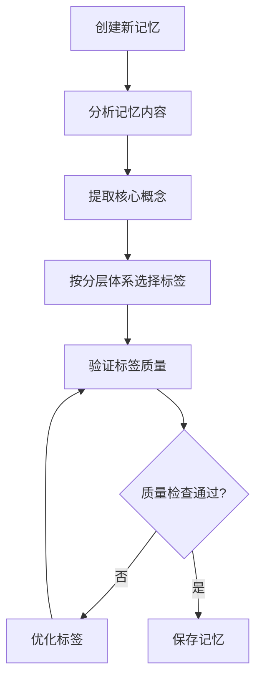

# 记忆项目标签策略指南

## 📖 概述

本文档提供记忆项目标签的完整策略，旨在最大化记忆检索的准确性和相关性。基于评分系统的工作机制，制定了分层标签体系和标准化流程。

## 🎯 核心原则

### 1. 用户查询导向
- **优先考虑用户实际使用的词汇**，而非学术术语
- **模拟真实业务场景**中的表达方式
- **避免过于抽象**的概念标签

### 2. 评分系统适配
- **标签匹配权重**: 3.0分/匹配
- **语义相关性权重**: 1.5倍加成
- **目标**: 让相关记忆在评分中脱颖而出

### 3. 可维护性
- **标准化命名规范**，便于管理
- **分层组织结构**，便于理解
- **定期优化机制**，持续改进

## 🏗 分层标签体系

### 第一层：核心功能标签（3-5个，必须）
**目标**: 直接描述记忆解决的主要问题

```yaml
优秀示例:
  - workflow-creation      # 工作流创建
  - api-enhancement       # API增强
  - data-validation       # 数据验证
  - solution-integration  # 解决方案集成
  - error-handling        # 错误处理

避免使用:
  - polymorphism         # 过于学术化
  - abstraction          # 概念太抽象
  - implementation       # 过于通用
```

### 第二层：技术实现标签（2-4个，推荐）
**目标**: 涉及的技术栈和实现方式

```yaml
优秀示例:
  - rest-api             # REST API
  - database-design      # 数据库设计
  - service-layer        # 服务层
  - controller-logic     # 控制器逻辑
  - json-processing      # JSON处理

避免使用:
  - design-pattern       # 太抽象
  - object-oriented      # 太通用
  - best-practice        # 不具体
```

### 第三层：概念组合标签（2-4个，重要）
**目标**: 复合概念，增强语义匹配

```yaml
优秀示例:
  - solution-as-step     # Solution作为步骤
  - mixed-step-types     # 混合步骤类型
  - id-prefix-routing    # ID前缀路由
  - step-validation      # 步骤验证
  - batch-processing     # 批量处理

设计原则:
  - 连字符连接多个概念
  - 体现业务场景的特定组合
  - 帮助语义匹配算法识别
```

### 第四层：架构设计标签（1-2个，可选）
**目标**: 保留关键的架构概念

```yaml
优秀示例:
  - architecture         # 架构设计
  - design               # 设计
  - microservice         # 微服务
  - scalability          # 可扩展性

使用条件:
  - 记忆确实涉及架构层面的决策
  - 用户可能用这些词汇搜索
  - 不超过2个架构标签
```

## 📝 标签命名规范

### 1. 格式规范
```yaml
正确格式:
  - solution-as-step     # 连字符分隔
  - api-enhancement      # 小写字母
  - workflow-creation    # 描述性但简洁

错误格式:
  - solution_as_step     # ❌ 下划线分隔
  - SolutionAsStep       # ❌ 驼峰命名
  - api_enhance_func     # ❌ 缩写+下划线
```

### 2. 词汇选择原则
```yaml
优先选择:
  - 常见技术术语: api, workflow, database
  - 动词形式: create, validate, enhance, optimize
  - 业务概念: solution, rule, step, validation

避免选择:
  - 生僻缩写: impl, proc, mgmt
  - 过长描述: enhance-api-functionality
  - 模糊概念: thing, stuff, item
```

## 📚 常用标签词典

### 核心业务概念
```
workflow, solution, rule, step, api, data, model, validation,
creation, enhancement, optimization, integration, reference,
authentication, authorization, configuration, deployment
```

### 技术栈标签
```
rest-api, database, controller, service, repository, entity,
dto, json, http, sql, nosql, cache, queue, microservice,
docker, kubernetes, spring-boot, react, vue
```

### 操作行为标签
```
create, update, delete, validate, enhance, optimize, fix,
implement, design, configure, deploy, test, monitor,
backup, restore, migrate, scale, secure
```

### 复合概念标签
```
solution-as-step, workflow-steps, solution-reference,
step-validation, mixed-step-types, id-prefix, api-enhancement,
batch-processing, real-time-sync, error-recovery,
data-consistency, performance-tuning
```

### 问题域标签
```
performance, security, scalability, reliability, usability,
maintainability, testing, debugging, monitoring, logging,
error-handling, data-integrity, user-experience
```

## 🧪 标签质量验证

### 1. 关键词覆盖测试
```python
def test_keyword_coverage(memory, tags):
    """测试标签是否覆盖记忆内容的主要关键词"""
    memory_keywords = extract_keywords(memory.content)
    tag_keywords = set(tags)
    
    coverage = len(memory_keywords & tag_keywords) / len(memory_keywords)
    
    assert coverage >= 0.3, f"标签覆盖率过低: {coverage:.2%}"
    return coverage
```

### 2. 用户查询匹配测试
```python
def test_user_query_matching():
    """模拟用户查询，验证标签匹配效果"""
    test_cases = [
        {
            "query": "增强API以支持Solution作为step",
            "expected_tags": ["api-enhancement", "solution-as-step"]
        },
        {
            "query": "实现工作流验证逻辑", 
            "expected_tags": ["workflow", "validation", "implementation"]
        },
        {
            "query": "优化数据库查询性能",
            "expected_tags": ["database", "optimization", "performance"]
        }
    ]
    
    for case in test_cases:
        matched_tags = find_matching_tags(case["query"])
        assert any(tag in matched_tags for tag in case["expected_tags"])
```

### 3. 竞争性评分测试
```python
def test_competitive_scoring(user_query, memories):
    """在相似记忆中，最相关的记忆应该得分最高"""
    scores = [(memory, calculate_score(memory, user_query)) for memory in memories]
    scores.sort(key=lambda x: x[1], reverse=True)
    
    # 验证最高分的记忆确实是最相关的
    top_memory = scores[0][0]
    assert is_most_relevant(top_memory, user_query, memories)
```

## 📊 优化案例分析

### 案例：F6G7记忆优化

#### 优化前（标签评分: 0.0）
```yaml
原始标签:
  - architecture
  - inheritance  
  - id-prefix
  - service-routing
  - polymorphism

问题分析:
  - 标签过于抽象和学术化
  - 与用户查询"Solution as step"无法匹配
  - 评分系统无法识别相关性
```

#### 优化后（标签评分: 36.0）
```yaml
优化标签:
  # 保留原有架构标签
  - architecture
  - inheritance
  - id-prefix
  - service-routing
  - polymorphism
  
  # 新增功能性标签
  - solution-as-step      # 核心概念匹配
  - workflow-steps        # 工作流步骤
  - solution-reference    # Solution引用
  - solution-id           # Solution ID
  - step-validation       # 步骤验证
  - mixed-step-types      # 混合步骤类型
  - api-enhancement       # API增强
  - workflow-creation     # 工作流创建

效果分析:
  - 标签评分提升36分
  - 成功进入前5名相关记忆
  - 用户查询匹配度显著提升
```

## 🔄 标签维护流程

### 1. 新记忆标签流程


### 2. 标签审查清单
```yaml
核心功能标签检查:
  - [ ] 是否直接描述解决的问题？
  - [ ] 用户会用这些词汇搜索吗？
  - [ ] 3-5个标签是否覆盖主要功能？

技术实现标签检查:
  - [ ] 是否涵盖主要技术栈？
  - [ ] 技术术语是否准确？
  - [ ] 2-4个标签是否足够？

概念组合标签检查:
  - [ ] 是否有独特的复合概念？
  - [ ] 复合概念是否帮助语义匹配？
  - [ ] 命名是否遵循连字符规范？

架构设计标签检查:
  - [ ] 架构标签是否必要？
  - [ ] 数量是否控制在1-2个？
  - [ ] 是否与用户查询场景相关？
```

### 3. 定期维护计划

#### 月度审查
```yaml
任务:
  - 分析用户查询日志
  - 识别常用词汇趋势
  - 检查经常被遗漏的重要记忆
  - 更新标签词典

输出:
  - 月度标签使用报告
  - 优化建议清单
  - 新增标签词汇
```

#### 季度优化
```yaml
任务:
  - 统计标签匹配命中率
  - 分析检索准确性指标
  - 优化低效标签
  - 标准化相似标签命名

输出:
  - 季度标签效果评估
  - 标签体系优化方案
  - 更新标签使用指南
```

#### 年度回顾
```yaml
任务:
  - 全面评估标签策略效果
  - 分析业务需求变化
  - 更新标签体系架构
  - 制定下年度优化计划

输出:
  - 年度标签策略评估报告
  - 标签体系演进计划
  - 新版标签使用指南
```

## 🛠 实施工具和模板

### 1. 标签质量检测脚本
```python
#!/usr/bin/env python3
"""
记忆项目标签质量检测工具
"""

def analyze_memory_tags(memory_file):
    """分析记忆文件的标签质量"""
    memories = load_memories(memory_file)
    
    for memory in memories:
        score = assess_tag_quality(memory)
        print(f"Memory {memory.id}: {score}/100")
        
        if score < 70:
            suggestions = suggest_tag_improvements(memory)
            print(f"建议优化: {suggestions}")

def assess_tag_quality(memory):
    """评估标签质量得分"""
    score = 0
    
    # 标签数量检查 (20分)
    tag_count = len(memory.tags)
    if 8 <= tag_count <= 15:
        score += 20
    elif 5 <= tag_count < 8 or 15 < tag_count <= 20:
        score += 15
    else:
        score += 10
    
    # 分层标签检查 (30分)
    core_tags = count_core_function_tags(memory.tags)
    tech_tags = count_tech_implementation_tags(memory.tags)
    concept_tags = count_concept_combination_tags(memory.tags)
    
    if core_tags >= 3: score += 15
    if tech_tags >= 2: score += 8
    if concept_tags >= 2: score += 7
    
    # 关键词覆盖检查 (25分)
    coverage = calculate_keyword_coverage(memory)
    score += int(coverage * 25)
    
    # 命名规范检查 (25分)
    naming_score = check_naming_conventions(memory.tags)
    score += naming_score
    
    return min(score, 100)
```

### 2. 新记忆标签模板
```markdown
### 记忆项目 #{{MEMORY_ID}}
- **时间**: {{TIMESTAMP}}
- **内容**: {{MEMORY_CONTENT}}
- **标签**: 
  {{CORE_FUNCTION_TAGS}}, 
  {{TECH_IMPLEMENTATION_TAGS}}, 
  {{CONCEPT_COMBINATION_TAGS}}, 
  {{ARCHITECTURE_DESIGN_TAGS}}
- **项目**: {{PROJECT_NAME}}
- **重要性**: {{IMPORTANCE_STARS}}

<!-- 标签检查清单
核心功能标签 (3-5个): [ ] 直接描述问题 [ ] 用户常用词汇
技术实现标签 (2-4个): [ ] 涵盖技术栈 [ ] 术语准确
概念组合标签 (2-4个): [ ] 独特概念 [ ] 语义匹配
架构设计标签 (1-2个): [ ] 确实必要 [ ] 用户相关
-->
```

### 3. 标签优化脚本
```bash
#!/bin/bash
# 批量优化现有记忆标签

echo "🔍 扫描所有记忆文件..."
find . -name "*.md" -path "*/memory/*" | while read file; do
    echo "分析文件: $file"
    python3 tools/analyze_memory_tags.py "$file"
done

echo "📊 生成优化报告..."
python3 tools/generate_tag_optimization_report.py

echo "🎯 应用推荐的标签优化..."
python3 tools/apply_tag_suggestions.py --interactive
```

## 📈 效果评估指标

### 1. 定量指标
```yaml
标签匹配率:
  - 计算方式: 匹配查询的标签数 / 总标签数
  - 目标值: > 60%
  - 监控频率: 周度

检索准确性:
  - 计算方式: 相关记忆排在前5名的比例
  - 目标值: > 85%
  - 监控频率: 月度

标签覆盖度:
  - 计算方式: 标签覆盖的内容关键词比例
  - 目标值: > 30%
  - 监控频率: 季度
```

### 2. 定性指标
```yaml
用户满意度:
  - 评估方式: 用户反馈调研
  - 关注点: 检索结果相关性
  - 监控频率: 季度

标签可理解性:
  - 评估方式: 团队成员评价
  - 关注点: 标签语义清晰度
  - 监控频率: 半年度

维护便利性:
  - 评估方式: 维护工作量统计
  - 关注点: 标签管理效率
  - 监控频率: 年度
```

## 📋 快速参考

### 标签选择速查表
```yaml
如果记忆涉及:
  API相关: api, rest-api, api-enhancement, api-design
  工作流: workflow, workflow-creation, workflow-steps
  数据处理: data, database, data-validation, data-processing
  解决方案: solution, solution-integration, solution-as-step
  验证逻辑: validation, step-validation, data-validation
  性能优化: performance, optimization, performance-tuning
  错误处理: error-handling, error-recovery, debugging
  架构设计: architecture, design, microservice, scalability
```

### 常见问题 Q&A
```yaml
Q: 标签太多会影响性能吗？
A: 8-15个标签是最佳范围，过多会稀释权重。

Q: 如何处理多语言标签？
A: 优先使用英文技术术语，保持一致性。

Q: 标签更新会影响历史检索吗？
A: 不会，评分是实时计算的，标签更新立即生效。

Q: 如何验证标签优化效果？
A: 使用提供的测试脚本和评估指标进行验证。
```

---

**文档版本**: v1.0  
**最后更新**: 2025-01-22  
**维护团队**: 工程团队  
**审核状态**: ✅ 已审核 